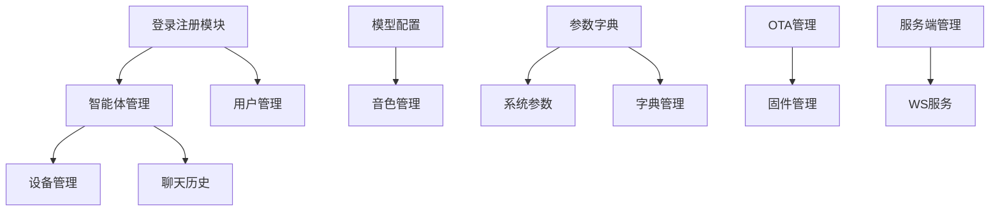

# 小智ESP32管理平台 Web架构分析与扩展指南

## 1. 项目架构概览

### 1.1 技术栈

- **前端框架**: Vue.js 2.x
- **UI组件库**: Element UI 2.15.x
- **状态管理**: Vuex 3.6.x
- **路由管理**: Vue Router 3.6.x
- **HTTP请求**: Flyio (类似Axios)
- **构建工具**: Vue CLI (webpack)
- **离线缓存**: Service Worker + Workbox

### 1.2 项目结构

```
src/
├── apis/               # API接口
│   ├── api.js          # API入口
│   ├── httpRequest.js  # HTTP请求封装
│   └── module/         # 模块化API
├── assets/             # 静态资源
├── components/         # 组件
├── router/             # 路由
├── store/              # Vuex存储
├── styles/             # 样式
├── utils/              # 工具函数
└── views/              # 页面视图
```

### 1.3 核心文件

- **main.js**: 应用入口，初始化Vue实例
- **App.vue**: 根组件
- **router/index.js**: 路由配置
- **store/index.js**: Vuex状态管理
- **apis/httpRequest.js**: HTTP请求封装
- **components/HeaderBar.vue**: 导航菜单组件

### 1.4 构建配置

项目使用Vue CLI构建，主要配置在vue.config.js中:

- 开发服务器端口: 8001
- API代理: 将/xiaozhi路径代理到http://127.0.0.1:8002
- CDN支持: 可选择使用CDN加载核心库
- Service Worker: 支持离线缓存
- 代码分割: 优化加载性能
- Gzip压缩: 减小传输体积

## 2. 功能模块关联分析

### 2.1 模块间关系



### 2.2 数据流向

1. **用户认证流程**:
   - 登录/注册 → 获取token → 存储在Vuex和localStorage → 后续请求携带token

2. **智能体管理流程**:
   - 获取智能体列表 → 绑定设备 → 配置智能体 → 查看聊天记录

3. **模型配置流程**:
   - 获取模型类型 → 获取供应商列表 → 配置模型参数 → 设置默认模型

4. **OTA更新流程**:
   - 上传固件 → 配置版本信息 → 设备检查更新

## 3. 扩展点分析

### 3.1 前端扩展点

1. **新增页面**:
   - 在`views/`目录添加新页面组件
   - 在`router/index.js`添加路由配置
   - 在`components/HeaderBar.vue`添加导航菜单项

2. **新增API模块**:
   - 在`apis/module/`目录添加新模块
   - 在`apis/api.js`中注册新模块

3. **新增状态管理**:
   - 在`store/index.js`中添加新的state、mutations和actions

4. **新增组件**:
   - 在`components/`目录添加可复用组件

### 3.2 后端接口扩展

1. **遵循RESTful风格**:
   - GET: 查询资源
   - POST: 创建资源
   - PUT: 更新资源
   - DELETE: 删除资源

2. **接口命名规范**:
   - 资源集合: `/模块名称/资源`
   - 特定资源: `/模块名称/资源/{id}`
   - 关联资源: `/模块名称/资源/{id}/关联资源`

3. **响应格式统一**:
   ```json
   {
     "code": 0,
     "msg": "success",
     "data": {}
   }
   ```

### 3.3 常见扩展场景

1. **新增智能体功能**:
   - 在`apis/module/agent.js`添加新API
   - 在智能体详情页面添加新功能UI
   - 更新Vuex状态管理

2. **新增模型类型**:
   - 在模型配置页面添加新类型支持
   - 在后端添加对应的供应商和模型接口

3. **新增设备管理功能**:
   - 在设备管理页面添加新操作
   - 在`apis/module/device.js`添加新API

4. **新增系统参数**:
   - 在参数管理页面添加新参数类型
   - 在后端添加参数处理逻辑

## 4. 扩展开发指南

### 4.1 添加新页面流程

1. **创建页面组件**:
   ```vue
   <template>
     <div class="new-feature-page">
       <!-- 页面内容 -->
     </div>
   </template>

   <script>
   export default {
     name: 'NewFeature',
     data() {
       return {
         // 页面数据
       }
     },
     methods: {
       // 页面方法
     }
   }
   </script>
   ```

2. **添加路由**:
   ```js
   // router/index.js
   {
     path: '/new-feature',
     name: 'NewFeature',
     component: function () {
       return import('../views/NewFeature.vue')
     },
     meta: {
       requiresAuth: true,
       title: '新功能'
     }
   }
   ```

3. **添加导航菜单**:
   ```vue
   <!-- HeaderBar.vue -->
   <div v-if="isSuperAdmin" class="equipment-management"
        :class="{ 'active-tab': $route.path === '/new-feature' }"
        @click="goNewFeature">
     
     新功能
   </div>
   ```

### 4.2 添加新API模块

1. **创建API模块文件**:
   ```js
   // apis/module/newFeature.js
   import { getServiceUrl } from '../api';
   import RequestService from '../httpRequest';

   export default {
     // 获取数据列表
     getDataList(params, callback) {
       RequestService.sendRequest()
         .url(`${getServiceUrl()}/new-feature/list`)
         .method('GET')
         .data(params)
         .success((res) => {
           RequestService.clearRequestTime();
           callback(res);
         })
         .networkFail((err) => {
           console.error('获取数据失败:', err);
           RequestService.reAjaxFun(() => {
             this.getDataList(params, callback);
           });
         }).send();
     },

     // 添加数据
     addData(data, callback) {
       RequestService.sendRequest()
         .url(`${getServiceUrl()}/new-feature`)
         .method('POST')
         .data(data)
         .success((res) => {
           RequestService.clearRequestTime();
           callback(res);
         })
         .networkFail((err) => {
           console.error('添加数据失败:', err);
           RequestService.reAjaxFun(() => {
             this.addData(data, callback);
           });
         }).send();
     }
   }
   ```

2. **注册API模块**:
   ```js
   // apis/api.js
   import newFeature from './module/newFeature.js'

   export default {
     getServiceUrl,
     user,
     admin,
     // ...其他模块
     newFeature // 添加新模块
   }
   ```

### 4.3 添加新组件

1. **创建组件文件**:
   ```vue
   <!-- components/NewFeatureDialog.vue -->
   <template>
     <el-dialog
       title="新功能"
       :visible.sync="dialogVisible"
       width="500px"
       @close="handleClose">
       <!-- 组件内容 -->
       <span slot="footer" class="dialog-footer">
         <el-button @click="handleClose">取消</el-button>
         <el-button type="primary" @click="handleConfirm">确定</el-button>
       </span>
     </el-dialog>
   </template>

   <script>
   export default {
     name: 'NewFeatureDialog',
     props: {
       value: {
         type: Boolean,
         default: false
       }
     },
     computed: {
       dialogVisible: {
         get() {
           return this.value;
         },
         set(val) {
           this.$emit('input', val);
         }
       }
     },
     methods: {
       handleClose() {
         this.dialogVisible = false;
       },
       handleConfirm() {
         // 处理确认逻辑
         this.dialogVisible = false;
       }
     }
   }
   </script>
   ```

2. **使用组件**:
   ```vue
   <template>
     <div>
       <el-button @click="showDialog">打开新功能</el-button>
       <new-feature-dialog v-model="dialogVisible" />
     </div>
   </template>

   <script>
   import NewFeatureDialog from '@/components/NewFeatureDialog.vue';

   export default {
     components: {
       NewFeatureDialog
     },
     data() {
       return {
         dialogVisible: false
       }
     },
     methods: {
       showDialog() {
         this.dialogVisible = true;
       }
     }
   }
   </script>
   ```

## 5. 最佳实践建议

### 5.1 代码组织

- **模块化**: 按功能模块组织代码
- **组件复用**: 抽取公共组件
- **API封装**: 统一API调用方式
- **状态管理**: 合理使用Vuex

### 5.2 性能优化

- **懒加载**: 路由和组件使用懒加载
- **CDN加速**: 使用CDN加载第三方库
- **缓存策略**: 合理使用Service Worker缓存
- **代码分割**: 按需加载代码

### 5.3 安全性

- **输入验证**: 前端进行输入验证
- **XSS防护**: 避免直接插入HTML
- **CSRF防护**: 使用token机制
- **权限控制**: 基于角色的访问控制

### 5.4 兼容性

- **浏览器兼容**: 支持主流现代浏览器
- **响应式设计**: 适配不同屏幕尺寸
- **优雅降级**: 在不支持某些特性的环境下提供替代方案

## 6. 常见问题与解决方案

### 6.1 跨域问题

- 开发环境: 使用Vue CLI的代理配置
- 生产环境: 配置正确的CORS头或使用同源部署

### 6.2 权限控制

- 使用路由守卫控制页面访问权限
- 根据用户角色动态显示/隐藏功能
- 在API请求中验证权限

### 6.3 数据缓存

- 使用Vuex存储会话数据
- 使用localStorage/sessionStorage存储持久数据
- 使用Service Worker缓存静态资源

### 6.4 离线支持

- 使用Service Worker缓存核心资源
- 提供离线页面
- 实现请求队列，在恢复连接时同步

## 7. 未来扩展方向

### 7.1 技术升级

- Vue 3迁移
- TypeScript支持
- 组件库升级

### 7.2 功能增强

- 更多智能体类型支持
- 高级数据分析和可视化
- 多语言国际化

### 7.3 性能优化

- 微前端架构
- WebAssembly加速
- 更智能的缓存策略

### 7.4 用户体验

- 深色模式
- 自定义主题
- 可访问性优化